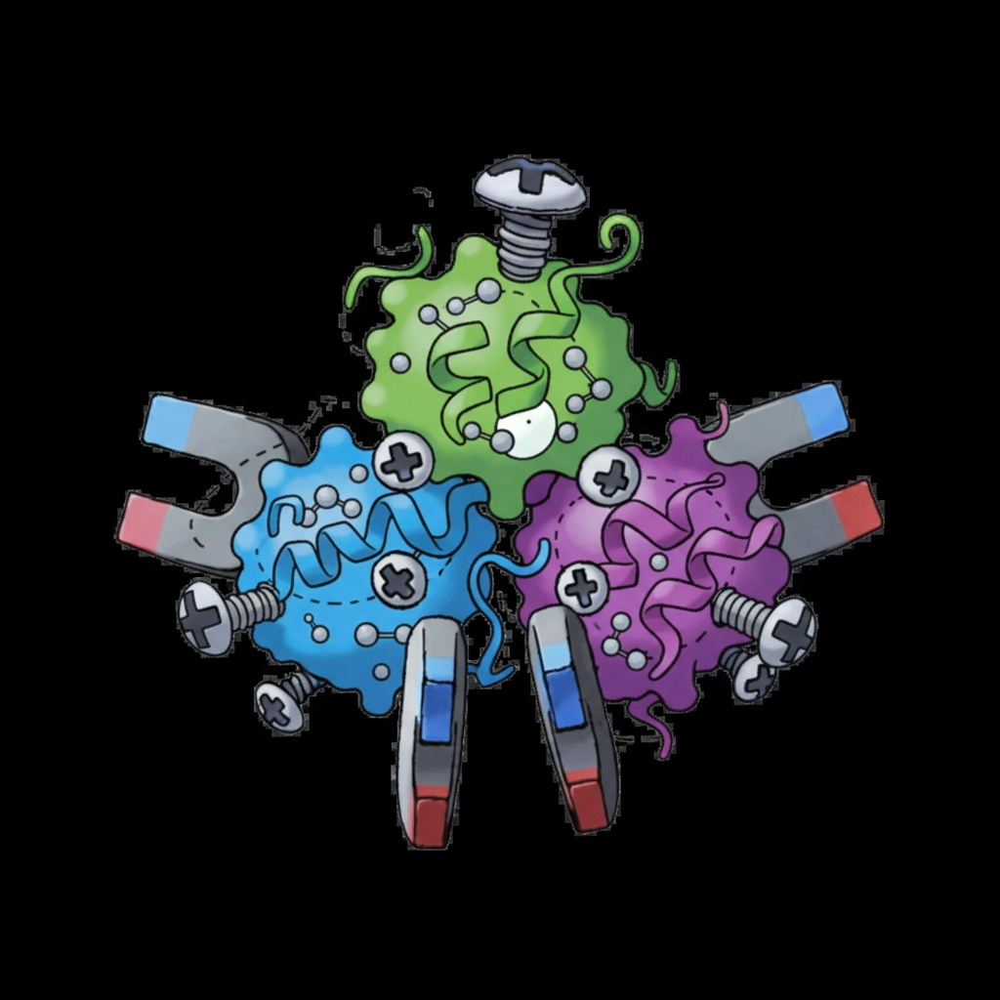

# Magneton
[](https://arxiv.org/abs/2512.18114)
[](https://huggingface.co/datasets/rcalef/magneton-data)


This repository provides the code for Magneton, an integrated environment for developing substructure-aware protein models, detailed in the paper Greater than the Sum of Its Parts: Building Substructure into Protein Encoding Models.

Magneton provides:
1. A large-scale dataset of 530,601 proteins annotated with over 1.7 million substructures spanning 13,075 types
2. A framework for using the above to train substructure-aware protein models or finetune existing models with substructural information.
3. A benchmark suite of 13 tasks probing residue-, substructure-, and protein-level representations.

Using Magneton, we develop substructure-tuning, a supervised finetuning method that distills substructural knowledge into pretrained protein models. Across state-of-the-art sequence- and structure-based models, substructure-tuning improves function-related tasks while revealing that substructural signals are complementary to global structural information.
## Contents

- [Contents](#contents)
- [Quickstart](#quickstart)
  - [Installation](#installation)
  - [Substructure classification](#substructure-classification)
    - [Substructure-tuning](#substructure-tuning)
  - [Running downstream evaluations](#running-downstream-evaluations)
- [Available models](#available-models)
- [Evaluation tasks](#evaluation-tasks)
- [Substructure types](#substructure-types)
- [Citing](#citing)


## Quickstart
### Installation

Install using [`uv`](https://docs.astral.sh/uv/). Given `uv` installed using instructions from their website, install this package as:
```
# After cloning
git submodule update --init

# --managed-python not strictly required, but can be helpful
# on shared systems with limited user configurability (e.g.
# university SLURM clusters)
uv sync --managed-python
```

The below commands are specifically for installing Flash Attention,
which is optional, but will speed up ESM-C, ESM2,
and SaProt models. Building and configuring Flash Attention
can require different steps (e.g. loading modules) depending
on the system, so we leave it as optional.
```
uv sync --extra flash
# Below is currently required for Flash Attention support
# for SaProt and ESM2. transformers 4.56.1 updates their ESM
# implementation to support flash attention, but EvoScale esm
# is currently marked as transformers < 4.48.2. See:
#  https://github.com/evolutionaryscale/esm/issues/265
uv pip install --upgrade-package transformers transformers
```

The Magneton datasets are available via our [HuggingFace dataset](https://huggingface.co/datasets/rcalef/magneton-data) and are exposed via the `MAGNETON_DATA_DIR` environment variable. For substructure-tuning, the directory containing the base model weights is exposed via  the `MAGNETON_MODEL_DIR` environment variable. Example setup:
```
cd /path/to/download
# Clone dataset
git clone git@hf.co:datasets/rcalef/magneton-data

# Clone model weights of interest, e.g ESM-C 300M
mkdir model_weights
git clone https://huggingface.co/EvolutionaryScale/esmc-300m-2024-12

echo "export MAGNETON_DATA_DIR=/path/to/download/magneton-data/" >> ~/.bashrc
echo "export MAGNETON_MODEL_DIR=/path/to/download/model_weights" >> ~/.bashrc
source ~/.bashrc
```

Now you can sanity check your install by running the included test cases:
```
cd /path/to/magneton
uv run pytest tests/
```
If the tests pass, you're good to go! If not, please feel free to open an issue to request help.

#### Structure data
For models that require structure data, we recommend downloading [AlphaFold DB's SwissProt release](https://alphafold.ebi.ac.uk/download#swissprot-section).

Our HuggingFace dataset contains a placeholder directory (`afdb_structures`) in which to extract the structure files. This is the default search location for structure files in our data configs, but if you already have AFDB structures downloaded elsewhere, you can just change the `data.struct_template` parameter in your run scripts to point to your directory of structure files.

### Substructure classification
To perform substructure classification, we invoke `magneton.cli`, where we use Hydra for managing configs. At a high-level, the most relevant parameters are

- **Base model**: The base protein model used for classification, e.g. `esm2_150m`, `esm2_3b`, `esmc_300m`, `prosst_2048`, `saprot_650m`,...
- **Substructure types**: One or more from `Active_site`, `Binding_site`, `Conserved_site`, `Domain`, `Homology`, `Secondary_structure`

The following example shows classification of  active site, binding site, and conserved site annotations using ESM-C 600M:

```bash
python -m magneton.cli \
  run_id=esmc_test_run \
  output_dir=/path/to/output \
  base_model=esmc \
  model.frozen_base_model=True \
  data=interpro103_swissprot \
  data.batch_size=32 \
  data.substruct_types=["Active_site","Binding_site","Conserved_site"]
```
for a test run, one can also use `training.dev_run=${num_batches}`, where `num_batches` is a small number of batches to run, and/or `data=debug`, which is a small dataset of ~10,000 proteins.

#### Substructure-tuning
Using supervised classification of substructures to finetune a model looks similar to above, with a few key differences. An example invocation:
```bash
python -m magneton.cli \
  run_id=esmc_ewc_test_run \
  output_dir=/path/to/output \
  base_model=esmc \
  base_model.model_params.use_flash_attn=true \
  model.frozen_base_model=false \
  training.loss_strategy="ewc" \
  data=interpro103_swissprot \
  data.batch_size=8 \
  data.substruct_types=["Active_site","Binding_site","Conserved_site"]
```
The relevant differences here are `model.frozen_base_model=false` and `training.loss_strategy="ewc"`, indicating to finetune the base model using EWC. Note that substructure-tuning requires much more VRAM than just substructure classification, so you may need to adjust `data.batch_size` and `training.accumulate_grad_batches` accordingly.

If multiple GPUs are available, Magneton will automatically attempt to perform distributed training using DDP (under the hood, we use [Lightning](https://lightning.ai/docs/pytorch/stable/)). If this is not desired, please adjust `training.devices` accordingly.

Upon completion, a checkpoint will be saved as `model_{run_name}.pt` containing the finetuned model.

For the full set of configurable parameters, please see `magneton/config.py`.

### Running downstream evaluations

After finetuning, you can evaluate models on the benchmark suite. Examples follow below, but the full set of evaluation tasks are listed in the [evaluation tasks](#evaluation-tasks) table below.

Example evaluation using a large suite of tasks:
```bash
python -m magneton.cli \
  run_id=esmc_downstream_evals \
  output_dir=/path/to/output \
  stage="eval" \
  base_model=esmc \
  training.max_epochs=20 \
  data.batch_size=32 \
  +evaluate=deepfri \
  evaluate.tasks="[GO:MF,GO:BP,GO:CC,EC,saprot_subloc,saprot_binloc,saprot_thermostability,human_ppi,FLIP_bind,biolip_binding,biolip_catalytic]" \
  evaluate.model_checkpoint="/path/to/finetuning/model_esmc_ewc_test_run.pt"
```

If desired, we can also perform full task-specific finetuning of the base model, similar to above. For example:

```bash
python -m magneton.cli \
  run_id=esmc_downstream_evals \
  output_dir=/path/to/output \
  stage="eval" \
  embedding=esmc \
  model.frozen_base_model=false \
  training.learning_rate="1e-2" \
  training.base_model_learning_rate="2e-5" \
  training.weight_decay=0.01 \
  training.base_model_weight_decay=0.01 \
  training.max_epochs=20 \
  data.batch_size=32 \
  +evaluate=deepfri \
  evaluate.tasks="[GO:MF,GO:BP,GO:CC,EC,saprot_subloc,saprot_binloc,saprot_thermostability,human_ppi,FLIP_bind,biolip_binding,biolip_catalytic]" \
  evaluate.model_checkpoint="/path/to/finetuning/model_esmc_ewc_test_run.pt"
```
where the relevant parameters are again `model.frozen_base_model=false` and the various parameters controlling learning rates for the head model and the base model.

#### Evaluation Suites

<!-- Evaluations are run using preset configurations that group related tasks:

- **`deepfri`**: Gene Ontology (GO:MF, GO:BP, GO:CC) and Enzyme Commission (EC) prediction
- **`peer`**: PEER benchmark tasks including GB1, β-lactamase, fluorescence, stability, thermostability, localization, and AAV
- **`proteingym`**: ProteinGym variant effect prediction (zero-shot) -->

Individual task lists can be customized via `evaluate.tasks`. For example:
```bash
evaluate.tasks="['FLIP_bind','human_ppi','biolip_binding','biolip_catalytic']"
```

After all evaluations complete, metrics are automatically aggregated into `combined_metrics.json` in the output directory.

## Available models
The currently integrated base models are:

| Model | Size | Type | Flash Attention | Model name for configs |
|-------|------|------|-----------------|------------------------|
| ESM2 | 150M, 650M, 3B | Sequence | Optional | `esm2_{model_size}` |
| ESM-C | 300M, 600M | Sequence | Optional | `esmc_300m`, `esmc` |
| SaProt | 35M, 650M | Sequence + Structure | Optional | `saprot_{model_size}` |
| ProSST-2048 | 110M | Sequence + Structure | Unsupported | `prosst_2048` |

When using SaProt or ProSST, additional structure tokens are required. These can either be calculated on the fly and then cached for future runs, or precomputed using the scripts at `scripts/[saprot|prosst]`. Precomputed structure tokens for the main Magneton dataset of SwissProt proteins and the various evaluation datasets are included in our HuggingFace dataset.

## Evaluation tasks
We include various evaluation tasks defined at different scales of protein representations. For more details on the definition of each dataset, please refer either to Appendix A.2 in our paper or each dataset's respective publication.

| Scale | Task | Task type | Metric | Data source | Task name for evaluation runs |
|-------|------|-----------|--------|-------------|---------------|
| **Interaction** | Human PPI prediction | Binary | Accuracy | [Pan et al. (2010)](https://pubs.acs.org/doi/abs/10.1021/pr100618t) | `human_ppi` |
| **Protein** | Gene Ontology prediction | Multilabel | F<sub>max</sub> | [Gligorijević et al. (2021)](https://www.nature.com/articles/s41467-021-23303-9) | `GO:BP`, `GO:CC`, `GO:MF` |
| | Enzyme Commission prediction | Multilabel | F<sub>max</sub> | [Gligorijević et al. (2021)](https://www.nature.com/articles/s41467-021-23303-9) | `EC` |
| | Subcellular localization | Multiclass | Accuracy | [Almagro Armenteros et al. (2017)](https://academic.oup.com/bioinformatics/article/33/21/3387/3931857) | `saprot_subloc` |
| | Binary localization | Binary | Accuracy | [Almagro Armenteros et al. (2017)](https://academic.oup.com/bioinformatics/article/33/21/3387/3931857) | `binary_localization`, `saprot_binloc` |
| | Thermostability prediction | Regression | Spearman's $\rho$ | [Rao et al. (2019)](https://arxiv.org/abs/1906.08230) | `thermostability`, `saprot_thermostability` |
| **Residue** | Contact prediction | Binary | Precision@L | [Rao et al. (2019)](https://arxiv.org/abs/1906.08230) | `contact_prediction` |
| | Variant effect prediction | Regression | Spearman's $\rho$ | [Notin et al. (2023)](https://www.biorxiv.org/content/10.1101/2023.12.07.570727v1) | `proteingym` |
| | Binding residue categorization | Multilabel | F<sub>max</sub> | [Dallago et al. (2021)](https://www.biorxiv.org/content/10.1101/2021.11.09.467890v1) | `FLIP_bind` |
| | Functional site prediction | Binary | AUROC | [Yuan et al. (2025)](https://arxiv.org/abs/2503.00089) | `biolip_binding`, `biolip_catalytic` |

<!-- How someone can add an evaluation and what space of evaluations we can support -->


## Substructure Types

Available substructure annotations from InterPro and SwissProt:

- **Active_site**: Catalytic residues
- **Binding_site**: Ligand/substrate binding residues
- **Conserved_site**: Evolutionarily conserved positions
- **Domain**: Protein domain boundaries
- **Homology**: Homologous superfamily regions
- **Secondary_structure**: Alpha helix, beta strand annotations

## Contributing
One of the goals of Magneton's design is to make it easy to add new models or evaluation tasks. Adding a new model just requires implementing model-specific data transformations (e.g. tokenization) and a base model class that implements a forward pass for generating residue- or protein-level embeddings. Full details of the Magneton architecture and how to add a new model can be found in the [architecture description](./magneton/ARCHITECTURE.md).

## Citing
Please consider citing `magneton` if it proves useful in your work.
```bibtex
@misc{calef2025greatersumpartsbuilding,
      title={Greater than the Sum of Its Parts: Building Substructure into Protein Encoding Models}, 
      author={Robert Calef and Arthur Liang and Manolis Kellis and Marinka Zitnik},
      year={2025},
      eprint={2512.18114},
      archivePrefix={arXiv},
      primaryClass={q-bio.QM},
      url={https://arxiv.org/abs/2512.18114}, 
}
```
